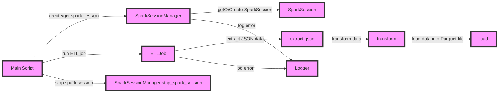

# Convert JSON to Parquet - PySpark

This project demonstrates a structured approach to building an ETL (Extract, Transform, Load) job using Python, PySpark, and custom exceptions. 
The code is organised into separate modules for logging, custom exceptions, Spark session management, and the ETL job itself.

## Modules Overview

***custom_exceptions.py***

### Defines two custom exception classes:

**ETLJobError:** Raised when errors occur during the ETL job.

**SparkSessionError:** Raised when errors occur related to the Spark session.

Each exception class has attributes for message, stage (for ETLJobError), component (for SparkSessionError), and details.

**logger.py**

### Provides logging functions:

**log_error(message):** Logs an error message.

**log_info(message):** Logs an info message.

### Uses Python's built-in logging module with a basic configuration.

**spark_session.py**

### Manages the creation and stopping of Spark sessions:

**get_spark_session(app_name):** Creates or retrieves a Spark session.

**stop_spark_session():** Stops the current Spark session if it exists.

**etl_job.py**

### Performs ETL operations using PySpark:

**extract_json(spark, input_file_path):** Extracts data from a JSON file.

**transform(df):** Transforms the extracted data by renaming column headers to uppercase.

**load(df, output_file_path):** Loads the transformed data into a Parquet file.

**run(spark, input_file_path_json, output_file_path_parquet):** Runs the ETL job.

**main.py**

### The main script that runs the ETL job:

Creates or retrieves a Spark session using SparkSessionManager.

Runs the ETL job using ETLJob.

Catches and logs custom exceptions using logger.

## ETL Job Pipeline

## Conclusion

This project demonstrates a structured approach to building an ETL job using Python, PySpark, and custom exceptions. 
The code is organised into separate modules for logging, custom exceptions, Spark session management, and the ETL job itself.
